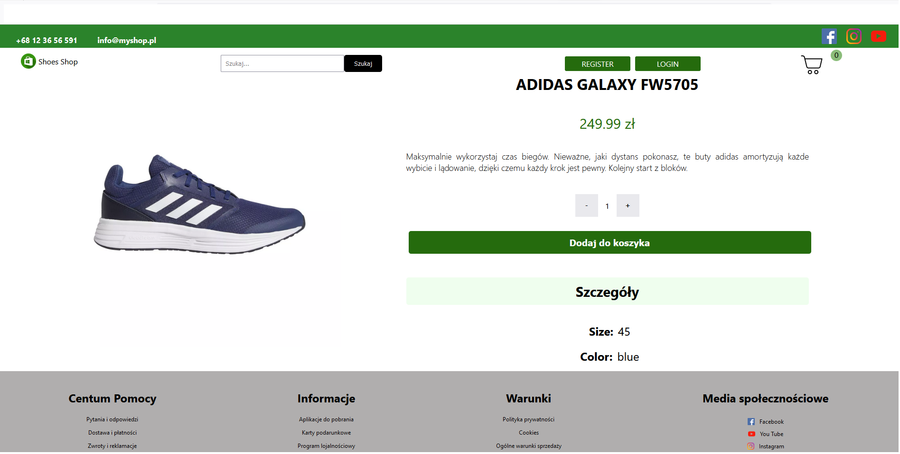

# Shoes Shop front-end

Application created for the purpose of study, an ecommerce store

## Roadmap

- Demo
- About the Project
- Tech Stack
- Screenshots
- Getting started

## Demo

Here is a working live demo: https://server-front-43pf.vercel.app/

## About the Project
I have made a modern ecommerce project with react, nodeJS and express.js of an online shop. In this application You can create new account, log-in, add products to application cart and change the amount of them. It is responsive and I have added pagination. The backend is prepared to create an admin profile to administrate orders, add or delete products to sell.
I think it is a good starting point, to develop it in accordance with  the client's guidelines. It is very universal so it can be easy to mach with even very  complex expectations of niche branch of  trade.

## Tech Stack

- react 18.2.0
- react-router-dom 6.9.0
- react-redux 8.0.5
- sass 1.59.3
- axios 1.3.4

# Screenshots
Products pages

Login pages

Cart pages

## Getting started

In the project directory, you can run:

### `https://github.com/joannaFiolka/My_Shop_front`

Install dependencies

### `npm install`

Start the server development

### `npm start`

